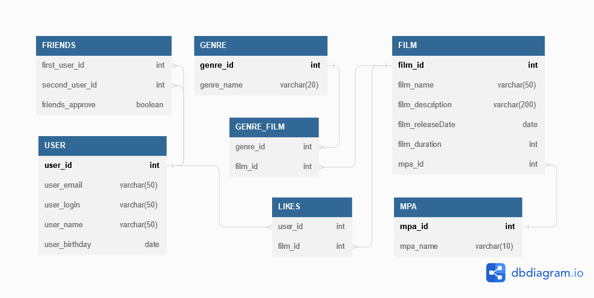
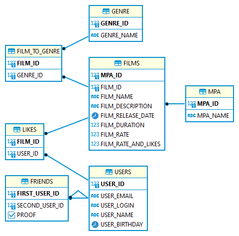

# java-filmorate
Template repository for Filmorate project.

### **_Бэкенд для сервиса, который будет работать с фильмами и оценками пользователей, а также возвращать топ-5 фильмов, рекомендованных к просмотру._**

# Спринт №9

### **_Модели данных_**
Пакет model. Два класса — Film и User. Это классы — модели данных приложения.

У model.Film должны быть следующие свойства:
* целочисленный идентификатор — id;
* название — name;
* описание — description;
* дата релиза — releaseDate;
* продолжительность фильма — duration.

Свойства model.User:
* целочисленный идентификатор — id;
* электронная почта — email;
* логин пользователя — login;
* имя для отображения — name;
* дата рождения — birthday.

### **_REST-контроллеры_**
Два класса-контроллера. FilmController обслуживает фильмы, а UserController — пользователей. 
Эндпоинты с подходящим типом запроса для каждого из случаев.

Для FilmController:
* добавление фильма;
* обновление фильма;
* получение всех фильмов.

Для UserController:
* создание пользователя;
* обновление пользователя;
* получение списка всех пользователей.
* Эндпоинты для создания и обновления данных должны также возвращают созданную или изменённую сущность.

### **_Валидация_**
Проверка данных, которые приходят в запросе на добавление нового фильма или пользователя. Эти данные должны соответствовать определённым критериям.

Для Film:
* название не может быть пустым;
* максимальная длина описания — 200 символов;
* дата релиза — не раньше 28 декабря 1895 года;
* продолжительность фильма должна быть положительной.

Для User:
* электронная почта не может быть пустой и должна содержать символ @;
* логин не может быть пустым и содержать пробелы;
* имя для отображения может быть пустым — в таком случае будет использован логин;
* дата рождения не может быть в будущем.

# Спринт №10

### **_Архитектура_**
* Интерфейсы FilmStorage и UserStorage, в которых определены методы добавления, удаления и модификации объектов.
* Классы InMemoryFilmStorage и InMemoryUserStorage, имплементирующие новые интерфейсы, и содержат всю логику хранения, обновления и поиска объектов.

### **_Новая логика_**

* UserService, отвечает за такие операции с пользователями, как добавление в друзья, удаление из друзей, вывод списка общих друзей. Пользователям не надо одобрять заявки в друзья — добавляем сразу. То есть если Лена стала другом Саши, то это значит, что Саша теперь друг Лены.
* FilmService, отвечает за операции с фильмами, — добавление и удаление лайка, вывод 10 наиболее популярных фильмов по количеству лайков. Пусть пока каждый пользователь может поставить лайк фильму только один раз.

### **_Полный REST_**
* PUT /users/{id}/friends/{friendId} — добавление в друзья.
* DELETE /users/{id}/friends/{friendId} — удаление из друзей.
* GET /users/{id}/friends — возвращаем список пользователей, являющихся его друзьями.
* GET /users/{id}/friends/common/{otherId} — список друзей, общих с другим пользователем.
* PUT /films/{id}/like/{userId} — пользователь ставит лайк фильму.
* DELETE /films/{id}/like/{userId} — пользователь удаляет лайк.
* GET /films/popular?count={count} — возвращает список из первых count фильмов по количеству лайков. Если значение параметра count не задано, верните первые 10.

# Спринт №11.1

### **_Создание схемы базы данных_**
* Каждый столбец таблицы должен содержать только одно значение.
* Хранить массивы значений или вложенные записи в столбцах нельзя.
* Все неключевые атрибуты должны однозначно определяться ключом.
* Все неключевые атрибуты должны зависеть только от первичного ключа, а не от других неключевых атрибутов.
* База данных должна поддерживать бизнес-логику, предусмотренную в приложении.

# Спринт №11.2

### **_Создание базы данных_**

База будет работает в двух режимах:
* В режиме тестирования H2 хранит данные в памяти. Это позволяет базе быстро запуститься на время тестов и удалить все тестовые данные после их завершения.
* В рабочем режиме H2 хранит данные в файле на жёстком диске. Это не позволяет рабочим данным потеряться между запусками.

### **_Работа с DAO_**
* DAO — объекты доступа к данным.
* В DAO соответствующие мапперы и методы, позволяющие сохранять пользователей и фильмы в базу данных и получать их из неё.

### **_Тестирование_**

Реализовано интеграционное тестирование. 
С помощью него проверяется работа приложения с зависимостями — например, 
с базой данных. Резидентная база данных обеспечивает автономность 
интеграционных тестов — перед каждым их запуском Spring создаёт новую, 
чистую БД.